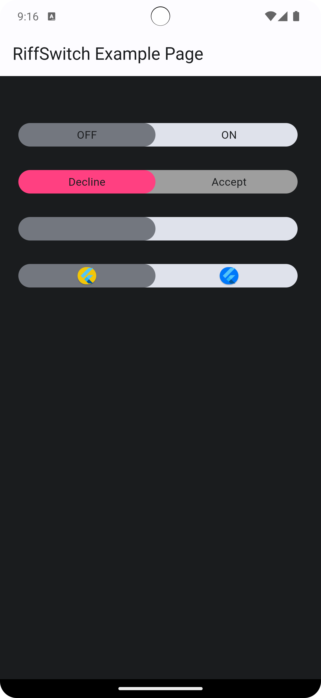
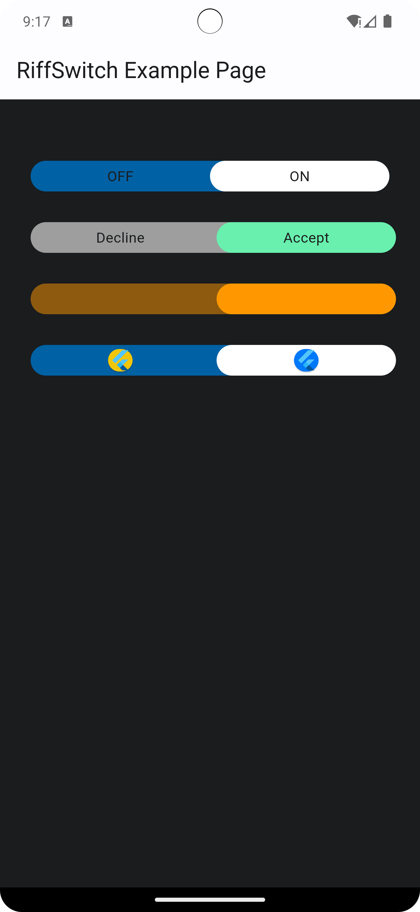
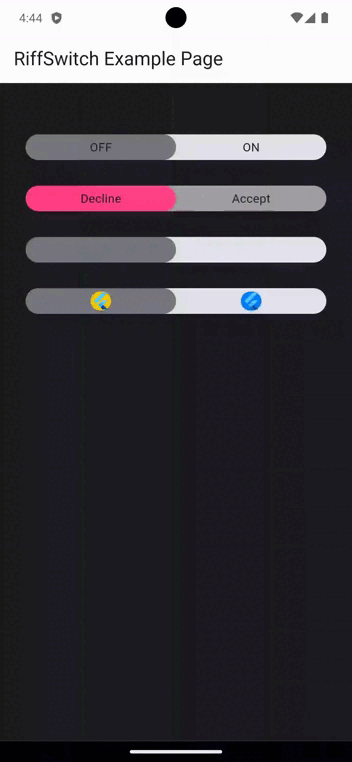

# RiffSwitch

RiffSwitch is a versatile and customizable Flutter widget that provides an advanced switch with various features, including sliding effects. It offers a seamless way to toggle between two states with a sleek appearance.

## Table of Contents
- [Installation](#installation)
- [Usage](#usage)
- [Features](#features)
- [Examples](#examples)
- [Screenshots](#screenshots)
- [Contributing](#contributing)
- [License](#license)

## Installation

To use RiffSwitch in your Flutter project, add the following to your `pubspec.yaml` file:

```yaml
dependencies:
  riff_switch:
    git:
      url: git@github.com:kenresoft/riff_switch.git
      ref: release
```
Then, run:

```bash
flutter pub get
````

## Usage

Import the package:

```dart 
import 'package:riff_switch/riff_switch.dart';
```

Add the RiffSwitch widget to your UI, providing the necessary parameters:

```dart
RiffSwitch(
  value: _isEnabled,
  onChanged: (bool newValue) {
    setState(() {
      _isEnabled = newValue;
    });
  },
  // Additional customization options...
)

```

## Features

* **Customization**: Customize the appearance with various options such as colors, texts, and child widgets.
* **Sliding Effects**: RiffSwitch supports sliding effects for a modern and interactive user experience.
* **Enum Types**: Choose between simple and decorative switch types based on your UI requirements.
* **Animation**:
  * **Smooth Transitions**: Enjoy smooth animations when the switch transitions between on and off states. 
  * **Interactive Dragging**: The sliding effects are accompanied by interactive dragging animations for a responsive feel.

## Examples

Here's a basic example of how to use RiffSwitch:
```dart
import 'package:flutter/material.dart';
import 'package:riff_switch/riff_switch.dart';

void main() {
  runApp(MyApp());
}

class MyApp extends StatelessWidget {
  @override
  Widget build(BuildContext context) {
    return MaterialApp(
      home: Scaffold(
        appBar: AppBar(
          title: Text('RiffSwitch Example'),
        ),
        body: Center(
          child: RiffSwitch(
            value: true,
            onChanged: (bool newValue) {
              // Handle switch state change
            },
            // Additional customization options...
          ),
        ),
      ),
    );
  }
}

```
More examples from [main.dart](example/lib/main.dart)
```dart
// 1
  RiffSwitch(
    value: _switchValue,
    onChanged: (value) => setState(() {
      _switchValue = value;
    }),
    type: RiffSwitchType.simple,
  ),

  const SizedBox(height: 30),

  // 2
  RiffSwitch(
    value: _switchValue,
    onChanged: (value) => setState(() {
      _switchValue = value;
    }),
    type: RiffSwitchType.simple,
    activeText: const Text("Accept"),
    inactiveText: const Text("Decline"),
    thumbColor: MaterialStateProperty.resolveWith((Set<MaterialState> states) {
      if (states.contains(MaterialState.selected)) {
        return Colors.greenAccent;
      }
      return Colors.pinkAccent;
    }),
    trackColor: MaterialStateProperty.resolveWith((Set<MaterialState> states) {
      if (states.contains(MaterialState.selected)) {
        return Colors.grey;
      }
      return Colors.grey;
    }),
  ),

  const SizedBox(height: 30),

  // 3
  RiffSwitch(
    value: _switchValue,
    onChanged: (value) => setState(() {
      _switchValue = value;
    }),
    type: RiffSwitchType.decorative,
    activeColor: Colors.orange,
  ),

  const SizedBox(height: 30),

  // 4
  RiffSwitch(
    value: _switchValue,
    onChanged: (value) => setState(() {
      _switchValue = value;
    }),
    type: RiffSwitchType.decorative,
    activeChild: const Card(
      color: CupertinoColors.systemBlue,
      child: FlutterLogo(),
    ),
    inactiveChild: const Card(
      color: CupertinoColors.systemYellow,
      child: FlutterLogo(),
    ),
  )
```


## Screenshots








## Contributing
Contributions are welcome! Feel free to open issues or submit pull requests.

## License
This project is licensed under the BSD 3-Clause License - see the [LICENSE](LICENSE) file for details.
